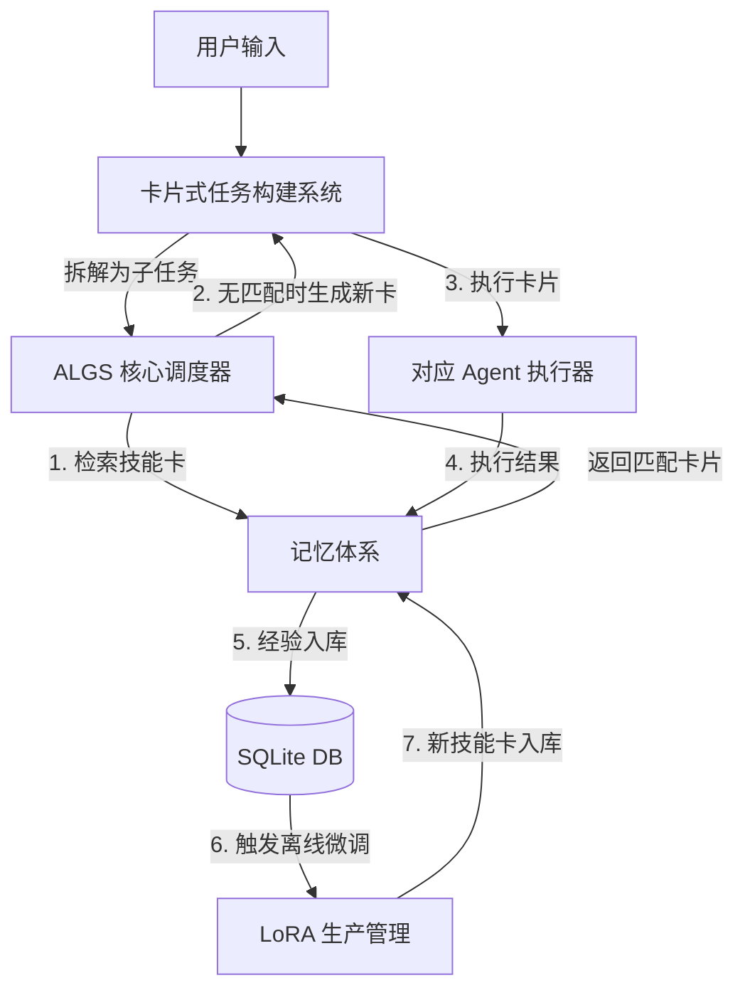

# ALGS 系统架构与构建说明文档 v1.0

**版本**：1.0
**日期**：2026-07-26
**适用范围**：Snacode 项目集成 (Electron + TypeScript + SQLite + Monaco + WSL)
**核心目标**：为 Mora Build 提供动态、可演进的 Agent 技能卡管理与执行系统。

---

## 1. 系统概述

ALGS（Agent LoRA Gen System）是一个为 AI Agent 提供"即时技能装配"能力的中间层系统。它不是模型本身，而是一个**调度、检索、组装、演化**的技能管理平台。

**核心理念**：

- **技能卡（Skill Card）**：是系统的最小操作单元，封装了特定任务所需的所有信息（Prompt、LoRA 路径、参数、示例等）。
- **记忆体系**：系统具备短期任务记忆与长期演化记忆，使 Agent 能在执行中学习和优化。
- **卡片式任务构建**：所有任务最终都会被拆解为一个或多个技能卡的组合执行。

---

## 2. 四大核心子系统

| 子系统 | 职责 | 关键技术栈 |
| :--- | :--- | :--- |
| **ALGS 核心调度器** | 接收任务，拆解为卡片，路由到对应 Agent 执行 | TypeScript, SQLite |
| **Agent 瓜分记忆体系** | 任务上下文暂存、经验积累、技能卡演化反馈 | SQLite + 向量存储 (Chroma/FAISS) |
| **卡片式任务构建系统** | 将用户需求转化为可执行的技能卡组合，支持卡片装配、版本管理 | Monaco Editor (卡片编辑), Diff (版本对比) |
| **LoRA 微调卡片生产管理体系** | 管理 LoRA 权重文件（下载、索引、元数据）、触发离线微调任务 | WSL (执行训练脚本), SQLite (元数据索引) |

---

## 3. 数据流全链路



---

## 4. 各子系统详细设计

### 4.1 ALGS 核心调度器

**核心职责**：

- 接收任务描述，解析意图。
- 调用记忆体系检索匹配技能卡。
- 管理任务执行状态（待执行、执行中、已完成、失败）。

**接口设计 (TypeScript)**：

```typescript
interface IALGSScheduler {
  // 提交一个任务，返回任务ID
  submitTask(task: TaskInput): Promise<string>;

  // 获取任务状态
  getTaskStatus(taskId: string): TaskStatus;

  // 任务执行结果回调
  onTaskComplete(taskId: string, result: any): void;
}

interface TaskInput {
  type: 'code' | 'image' | '3d' | 'office' | 'ui' | 'custom';
  description: string;
  context?: any; // 额外上下文
  priority?: 'high' | 'medium' | 'low';
}

interface SkillCard {
  id: string;
  name: string;
  description: string; // 用于向量检索
  taskType: string;
  systemPrompt: string;
  fewShotExamples?: string[];
  loraPath?: string; // 可选的 LoRA 文件路径
  parameters: Record<string, any>;
  version: number;
  createdAt: string;
  updatedAt: string;
}
```

**SQLite 表结构**：

```sql
-- 任务表
CREATE TABLE tasks (
  id TEXT PRIMARY KEY,
  type TEXT NOT NULL,
  description TEXT NOT NULL,
  status TEXT NOT NULL, -- pending, running, completed, failed
  result TEXT,
  created_at DATETIME DEFAULT CURRENT_TIMESTAMP
);

-- 技能卡表
CREATE TABLE skill_cards (
  id TEXT PRIMARY KEY,
  name TEXT NOT NULL,
  description TEXT NOT NULL,
  task_type TEXT NOT NULL,
  system_prompt TEXT NOT NULL,
  few_shot TEXT, -- JSON 数组
  lora_path TEXT,
  parameters TEXT, -- JSON 对象
  version INTEGER DEFAULT 1,
  created_at DATETIME DEFAULT CURRENT_TIMESTAMP,
  updated_at DATETIME DEFAULT CURRENT_TIMESTAMP
);

-- 向量索引表 (通过外部向量库管理)
-- 用于技能卡的 description 字段的向量检索
```

---

### 4.2 Agent 瓜分记忆体系

**核心职责**：

- **短期记忆**：存储当前会话的任务上下文，确保多轮对话的连贯性。
- **长期记忆**：存储历史任务执行记录（输入、输出、用户反馈），用于经验积累。
- **演化反馈**：基于执行结果和用户评价，调整技能卡的权重或触发新的训练。

**接口设计**：

```typescript
interface IMemorySystem {
  // 存储一条记忆
  storeMemory(entry: MemoryEntry): Promise<void>;

  // 检索相关记忆（用于上下文构建）
  retrieveMemories(query: string, limit: number): Promise<MemoryEntry[]>;

  // 基于任务结果生成反馈，用于后续演化
  generateFeedback(taskId: string): Promise<Feedback>;
}

interface MemoryEntry {
  id: string;
  taskId: string;
  role: 'user' | 'agent' | 'system';
  content: string;
  embedding?: number[]; // 向量
  metadata: Record<string, any>;
  created_at: string;
}

interface Feedback {
  score: number; // 1-10 评分
  suggestion: string; // 改进建议
  suitableForTraining: boolean; // 是否适合用于训练
}
```

**SQLite 扩展**：

- 使用 `sqlite-vec` 扩展，在 SQLite 内部实现向量检索，避免引入额外向量数据库。
- 或通过 WSL 调用 Python 脚本进行向量计算。

---

### 4.3 卡片式任务构建系统

**核心职责**：

- 提供可视化/代码化的卡片编辑界面（基于 Monaco Editor）。
- 支持卡片版本管理（基于 Diff 对比）。
- 将用户需求转化为卡片组合（任务拆解）。

**集成到 Snacode 的方式**：

- **UI 集成**：在 Electron 主窗口右侧或独立面板嵌入 Monaco Editor，编辑技能卡的 System Prompt 和 Few-shot 示例。
- **版本管理**：使用 SQLite 存储卡片的版本历史，Diff 对比功能可直接调用 Monaco 的 DiffEditor。

**卡片构建流程**：

1. 用户选择/创建任务模板。
2. 在编辑器中编写或修改 System Prompt、调整参数。
3. 保存为新技能卡，自动生成向量并入库。
4. 支持从现有卡片"派生"新卡片（版本继承）。

**示例卡片 JSON 结构**：

```json
{
  "id": "card_code_review_v2",
  "name": "代码审查助手",
  "description": "对提交的代码进行审查，指出潜在问题并提供改进建议",
  "taskType": "code",
  "systemPrompt": "你是一位资深软件工程师，请对以下代码进行严格的代码审查...",
  "fewShotExamples": [
    "用户输入: ... 你的输出: ..."
  ],
  "parameters": {
    "temperature": 0.3,
    "max_tokens": 4096
  },
  "version": 2
}
```

---

### 4.4 LoRA 微调卡片生产管理体系

**核心职责**：

- 管理 `.safetensors` 格式的 LoRA 权重文件（下载、索引、元数据维护）。
- 调度离线微调任务（通过 WSL 执行 `unsloth` 或 `axolotl` 训练脚本）。
- 将训练好的 LoRA 文件自动注册为新的技能卡。

**接口设计**：

```typescript
interface ILoRAManager {
  // 索引本地 LoRA 文件
  indexLocalLora(loraPath: string): Promise<LoraMetadata>;

  // 下载远程 LoRA (从 CivitAI 等)
  downloadLora(url: string): Promise<string>;

  // 触发离线微调任务
  triggerTraining(config: TrainingConfig): Promise<string>;

  // 微调完成后自动注册技能卡
  registerTrainedLora(loraPath: string, taskType: string): Promise<SkillCard>;
}

interface LoraMetadata {
  path: string;
  baseModel: 'sd1.5' | 'sdxl' | 'flux' | 'llama' | 'qwen';
  sizeMB: number;
  description?: string;
  tags?: string[];
  downloadedAt: string;
}
```

**与 WSL 的集成**：

- Snacode 通过 `child_process` 调用 WSL 命令。
- 训练脚本存放在 `scripts/train_lora.py`，通过参数传递数据集路径、基座模型路径、输出路径。

**微调触发流程**：

1. 记忆体系积累到 50+ 条高质量样本（用户反馈良好）。
2. ALGS 调度器标记该任务类型为"可训练"。
3. LoRA Manager 在 WSL 中启动训练任务。
4. 训练完成后，自动生成新技能卡并入库。

---

## 5. 与 Snacode 的集成方案

### 5.1 目录结构建议

在 Snacode 项目根目录下新建 `algs` 模块：

```
snacode/
├── src/
│   ├── algs/
│   │   ├── scheduler/           # ALGS 核心调度器
│   │   │   ├── index.ts
│   │   │   └── taskQueue.ts
│   │   ├── memory/              # 记忆体系
│   │   │   ├── index.ts
│   │   │   └── vectorStore.ts   # 基于 sqlite-vec
│   │   ├── cardBuilder/         # 卡片构建系统
│   │   │   ├── index.ts
│   │   │   ├── editor.tsx       # Monaco 集成
│   │   │   └── diff.ts          # Diff 对比
│   │   ├── lora/                # LoRA 生产管理
│   │   │   ├── index.ts
│   │   │   ├── downloader.ts
│   │   │   └── wslRunner.ts     # WSL 脚本调用
│   │   └── types.ts             # 公共类型定义
├── scripts/
│   └── train_lora.py            # WSL 中运行的训练脚本
├── data/
│   ├── loras/                   # 存储 LoRA .safetensors 文件
│   └── training_data/           # 微调数据集缓存
└── algs.db                      # SQLite 数据库文件
```

### 5.2 SQLite 完整 Schema

```sql
-- 任务表
CREATE TABLE tasks (...);

-- 技能卡表
CREATE TABLE skill_cards (...);

-- 记忆表 (带向量支持)
CREATE TABLE memories (
  id TEXT PRIMARY KEY,
  task_id TEXT,
  role TEXT NOT NULL,
  content TEXT NOT NULL,
  embedding BLOB,  -- 存储向量
  metadata TEXT,   -- JSON
  created_at DATETIME DEFAULT CURRENT_TIMESTAMP
);

-- LoRA 元数据表
CREATE TABLE lora_metadata (
  id TEXT PRIMARY KEY,
  file_name TEXT NOT NULL,
  file_path TEXT NOT NULL,
  base_model TEXT NOT NULL,
  size_mb REAL,
  description TEXT,
  tags TEXT,       -- JSON 数组
  downloaded_at DATETIME DEFAULT CURRENT_TIMESTAMP
);

-- 训练任务表
CREATE TABLE training_jobs (
  id TEXT PRIMARY KEY,
  task_type TEXT NOT NULL,
  status TEXT NOT NULL, -- pending, running, completed, failed
  lora_output_path TEXT,
  log_path TEXT,
  created_at DATETIME DEFAULT CURRENT_TIMESTAMP
);

-- 任务-卡片关联表 (记录每次任务使用了哪些卡片)
CREATE TABLE task_card_usage (
  task_id TEXT,
  card_id TEXT,
  score REAL, -- 该卡片在此任务中的贡献评分
  PRIMARY KEY (task_id, card_id)
);
```

### 5.3 Electron IPC 通道

暴露以下主要 IPC 通道给渲染进程：

| 通道名 | 用途 |
| :--- | :--- |
| `algs:submitTask` | 提交任务 |
| `algs:getTasks` | 获取任务列表 |
| `algs:getSkillCards` | 获取技能卡列表 |
| `algs:saveSkillCard` | 保存/更新技能卡 |
| `algs:deleteSkillCard` | 删除技能卡 |
| `algs:diffCards` | 对比两个卡片的差异 |
| `algs:downloadLora` | 下载 LoRA 文件 |
| `algs:triggerTraining` | 触发离线微调 |

---

## 6. 技术选型理由

| 组件 | 选型 | 理由 |
| :--- | :--- | :--- |
| **UI 框架** | React + Monaco Editor | Snacode 已在使用，集成成本低；Monaco 支持 JSON 编辑和 Diff |
| **数据库** | SQLite + sqlite-vec | 零配置、嵌入式、支持向量检索，完美适配桌面应用 |
| **底层 CLI** | Rust (Mora Build) | 直接编译 Grok Build 源码，性能高且可控 |
| **推理引擎** | vLLM (通过 WSL) | 支持动态 LoRA 加载，与 Mora Build 集成顺畅 |
| **训练脚本** | Python + Unsloth | 在 WSL 中运行，支持 LoRA 高效微调 |
| **版本对比** | Monaco DiffEditor | 原生支持，可直接嵌入 Electron |

---

## 7. 实施路线图

| 阶段 | 时间 | 核心任务 |
| :--- | :--- | :--- |
| **Phase 1** | 第 1-2 周 | 搭建 SQLite Schema，实现 ALGS 核心调度器，支持任务队列管理 |
| **Phase 2** | 第 3-4 周 | 实现记忆体系（短期记忆 + sqlite-vec 向量检索） |
| **Phase 3** | 第 5-6 周 | 集成 Monaco Editor，实现技能卡的创建、编辑、版本对比 |
| **Phase 4** | 第 7-8 周 | 实现 LoRA 下载管理 + WSL 脚本调用，打通离线训练链路 |
| **Phase 5** | 第 9-10 周 | 端到端联调：任务提交 → 卡片检索 → Agent 执行 → 结果反馈 → 自动训练 |
